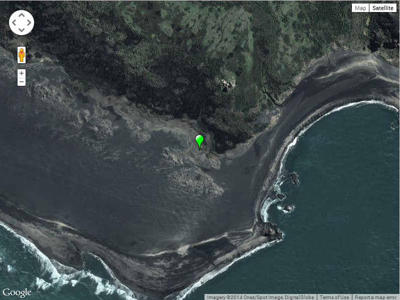
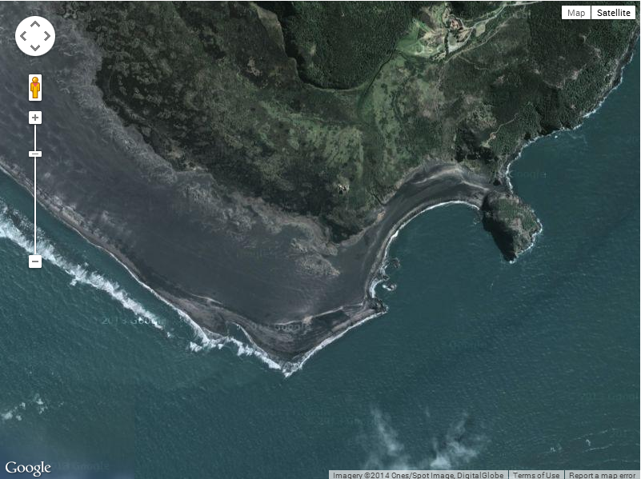

cfmap
===

The `<cfmap>` tag provides the ability to create maps in CFML. `<cfmap>` uses the Google Map API under the hood to provide the maps.

For this chapter we will make use of the [Google Maps API](https://developers.google.com/maps/) directly.

Here's an example using `<cfmap>` to render a basic satellite map of [Whatipu](http://en.wikipedia.org/wiki/Whatipu), just out of Auckland, New Zealand:

**Listing 1 : exampleUsingCfMap.cfm**
    
    <cfmap
        centerlatitude	= "-37.0477058"
        centerlongitude	= "174.500332"
        type			= "satellite"
        zoomlevel		= "16"
        width			= "800"
        height			= "600"
    />

This renders:

Now here is an analogous map, totally written in simple HTML, JavaScript and CSS. 

**Listing 2 : exampleUsingGoogleMaps.html**
    
    <!DOCTYPE html>
    <html>
    <head>
        <link rel="stylesheet" type="text/css" href="exampleUsingGoogleMaps.css">
        
    </head>
    <body>
        

        
    </body>
    </html>

**Listing 3 : exampleUsingGoogleMaps.js**
    
    var map;
    function initialise() {
        var mapOptions = {
            zoom        : 15,
            center      : new google.maps.LatLng(-37.0477058,174.500332),
            mapTypeId   : google.maps.MapTypeId.SATELLITE
        };
        map = new google.maps.Map(document.getElementById('map-canvas'), mapOptions);
    }

    google.maps.event.addDomListener(window, 'load', initialise);	
	
**Listing 4 : exampleUsingGoogleMaps.css**

    html, body, #map-canvas {
        width    : 800px;
        height   : 600px;
    }

As you can see, the only mark-up needed is the map-canvas `
`. The rest is done with JavaScript (and a touch of CSS to style the canvas). Here's the render:

Resources
---
* [Google Maps API documentation](https://developers.google.com/maps/documentation/javascript/reference)

Alternatives
---

* [Google Maps Web Component](http://googlewebcomponents.github.io/google-map/components/google-map/#google-map)
